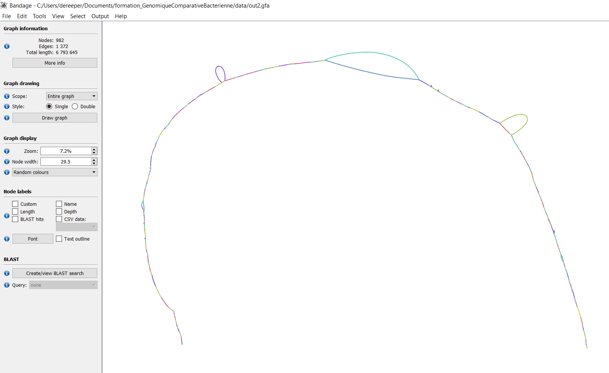

# Handsome bacterial comparative genomics

## **First commands for preparing the working environment**

First create your working directory:

```bash
mkdir -p {{extra.project_path}}/training_bcg
cd {{extra.project_path}}/training_bcg
```

We can now download the git repository of this training that contains material needed for the training.

```bash
git clone https://github.com/SouthGreenPlatform/training_bacterial_comparative_genomics.git
```

We also need some raw data:

```bash
mkdir raw_data
cd raw_data
wget https://panexplorer.southgreen.fr/data/mysample.fastq.gz
```
     

!!! question
        How many reads are there in the raw Fastq file?

??? example "Solution"
    ```bash
    zcat raw_data/CIX4108.sample.fastq.gz | wc -l
    ```

## **Genome Assembly (from Oxford Nanopore Technologies (ONT) long reads) (using Flye)**

We start by creating and moving into a directory dedicated for the task:

```bash
mkdir -p {{extra.project_path}}/training_bcg/assembly
cd {{extra.project_path}}/training_bcg/assembly
```

We will use Flye to perform the genome assembly. 
Load the appropriate module for flye (module load) or install the tool locally with conda 

```bash
conda create -n flye -c bioconda flye
conda activate flye
```

We can now run the assembly   

```bash
flye --nano-raw /data2/formation/Bacterial_genomics/raw_data/CIX4108.sample.fastq -o assembly >>flye.log 2>&1
```

As this task is time consuming we can stop the tool with `CTRL-C` and download the expected output:

```bash
cp -rf {{extra.project_path}}/training_bcg/training_bacterial_comparative_genomics/data/precomputed_assembly/assembly_precomputed.fasta assembl .
```

!!! question
        How many sequence do we have?

??? example "Solution"
    ```bash
    grep -c ">" assembly_precomputed.fasta
    ```

     

## **Separate chromosomal and plasmid scaffolds (using MOB-Suite)**

Let's start by creating and moving into a directory dedicated for the task:

```bash
mkdir -p {{extra.project_path}}/training_bcg/mob_recon
cd {{extra.project_path}}/training_bcg/mob_recon
```

```
singularity exec /home/jovyan/mob_suite_3.0.3.sif mob_recon -i assembly/assembly_precomputed.fasta -o assembly.mob_recon >>mob_recon.log 2>&1
```     

The precomputed result can be retrieved here

```bash
cp -rf {{extra.project_path}}/training_bcg/training_bacterial_comparative_genomics/data/mob_recon/* .
```
     
The results is made by 4 files `chromosome.fasta  contig_report.txt  mobtyper_results.txt  plasmid_AD399.fasta`

We can have a look at the report:

```
more contig_report.txt
```

??? example "Solution"  
        sample_id	molecule_type	primary_cluster_id	secondary_cluster_id	contig_id	size	gc	md5	circularity_status	rep_type(s)	rep_type_accession(s)	relaxase_type(s)	relaxase_type_accession(s)	mpf_type	mpf_type_accession(s)	orit_type(s)	orit_accession(s)	predicted_mobility	mash_nearest_neighbor	mash_neighbor_distance	mash_neighbor_identification	repetitive_dna_id	repetitive_dna_type	filtering_reason
        assembly_precomputed	chromosome	-	-	contig_1_circular_rotated	4682534	63.833983907004196	cf955654136e9041810a80b8191fa41f	not tested	-	-	MOBP	NC_007507_00032	-	-	-	-	-	-	-	-	-	-	-
        assembly_precomputed	plasmid	AD399	-	contig_2_circular_rotated	69058	61.861044339540676	475037e138b4ade1836aa05f421c47b8	not tested	rep_cluster_1289	000607__CP000620_00033	MOBP	CP022994_00148	-	-	-	-	-	CP033195	0.0537328	Xanthomonas oryzae pv. oryzae	-	-	-


## **Genome annotation (using Prokka)**

We will now annotate the chromosome.
Let's start by creating and moving into a directory dedicated for the task:

```bash
mkdir -p {{extra.project_path}}/training_bcg/prokka
cd {{extra.project_path}}/training_bcg/prokka
ln -s {{extra.project_path}}/training_bcg/mob_recon/chromosome.fasta
```

We will use Prokka to perform the genome annotation. Let's start by installing the tool:

```bash
conda create -n prokka -c conda-forge -c bioconda prokka
conda activate prokka
```

We can now launch the annotation: 

```bash
prokka chromosome.fasta --prefix assembly --force --outdir prokka_out >> prokka.log 2>&1
```
     
You can now deactivate the prokka conda environment

```bash
conda deactivate
```
     
Let's have a look at the Genebank output file:

```bash
head -40 prokka_out/assembly.gbk
```

??? example "Solution"    
        LOCUS       contig_1_circular_rotated4682534 bp   DNA  linear       10-JUN-2022
        DEFINITION  Genus species strain strain.
        ACCESSION   
        VERSION
        KEYWORDS    .
        SOURCE      Genus species
        ORGANISM  Genus species
                    Unclassified.
        COMMENT     Annotated using prokka 1.14.6 from
                    https://github.com/tseemann/prokka.
        FEATURES             Location/Qualifiers
            source          1..4682534
                            /organism="Genus species"
                            /mol_type="genomic DNA"
                            /strain="strain"
            CDS             1..1329
                            /gene="dnaA"
                            /locus_tag="GBGACGDJ_00001"
                            /inference="ab initio prediction:Prodigal:002006"
                            /inference="similar to AA sequence:UniProtKB:P03004"
                            /codon_start=1
                            /transl_table=11
                            /product="Chromosomal replication initiator protein DnaA"
                            /db_xref="COG:COG0593"
                            /translation="MDAWPRCLERLEAEFPPEDVHTWLKPLQAEDRGDSIVLYAPNAF
                            IVDQVRERYLPRIRELLAYFAGNREVALAVGSRPRAPEPEPAPVAATIAPQAAPIAPF
                            AGNLDSHYTFANFVEGRSNQLGLAAAIQAAQKPGDRAHNPLLLYGSTGLGKTHLMFAA
                            GNALRQAKPAAKVMYLRSEQFFSAMIRALQDKAMDQFKRQFQQIDALLIDDIQFFAGK
                            DRTQEEFFHTFNALFDGRQQIILTCDRYPREVEGLEPRLKSRLAWGLSVAIDPPDFET
                            RAAIVLAKARERGAEIPDDVAFLIAKKMRSNVRDLEGALNTLVARANFTGRSITVEFA
                            QETLRDLLRAQQQAIGIPNIQKTVADYYGLQMKDLLSKRRTRSLARPRQVAMALAKEL
                            TEHSLPEIGDAFAGRDHTTVLHACRQIRTLMEADGKLREDWEKLIRKLSE"
            CDS             1607..2389
                            /gene="dnaN_1"
                            /locus_tag="GBGACGDJ_00002"
                            /inference="ab initio prediction:Prodigal:002006"
                            /inference="similar to AA sequence:UniProtKB:Q9I7C4"
                            /codon_start=1
                            /transl_table=11
                            /product="Beta sliding clamp"


Now let's have a look at the GFF output file:

```bash
head -10 prokka_out/assembly.gff
```

??? example "Solution"  
        ##gff-version 3
        ##sequence-region contig_1_circular_rotated 1 4682534
        contig_1_circular_rotated	Prodigal:002006	CDS	1	1329	.	+	0	ID=GBGACGDJ_00001;Name=dnaA;db_xref=COG:COG0593;gene=dnaA;inference=ab initio prediction:Prodigal:002006,similar to AA sequence:UniProtKB:P03004;locus_tag=GBGACGDJ_00001;product=Chromosomal replication initiator protein DnaA
        contig_1_circular_rotated	Prodigal:002006	CDS	1607	2389	.	+	0	ID=GBGACGDJ_00002;Name=dnaN_1;db_xref=COG:COG0592;gene=dnaN_1;inference=ab initio prediction:Prodigal:002006,similar to AA sequence:UniProtKB:Q9I7C4;locus_tag=GBGACGDJ_00002;product=Beta sliding clamp
        contig_1_circular_rotated	Prodigal:002006	CDS	2346	2708	.	+	0	ID=GBGACGDJ_00003;Name=dnaN_2;db_xref=COG:COG0592;gene=dnaN_2;inference=ab initio prediction:Prodigal:002006,similar to AA sequence:UniProtKB:P0A988;locus_tag=GBGACGDJ_00003;product=Beta sliding clamp
        contig_1_circular_rotated	Prodigal:002006	CDS	3777	4883	.	+	0	ID=GBGACGDJ_00004;Name=recF;db_xref=COG:COG1195;gene=recF;inference=ab initio prediction:Prodigal:002006,similar to AA sequence:UniProtKB:P0A7H0;locus_tag=GBGACGDJ_00004;product=DNA replication and repair protein RecF
        contig_1_circular_rotated	Prodigal:002006	CDS	4999	7443	.	+	0	ID=GBGACGDJ_00005;eC_number=5.6.2.2;Name=gyrB;db_xref=COG:COG0187;gene=gyrB;inference=ab initio prediction:Prodigal:002006,similar to AA sequence:UniProtKB:P0A2I3;locus_tag=GBGACGDJ_00005;product=DNA gyrase subunit B
        contig_1_circular_rotated	Prodigal:002006	CDS	7511	8347	.	+	0	ID=GBGACGDJ_00006;inference=ab initio prediction:Prodigal:002006;locus_tag=GBGACGDJ_00006;product=hypothetical protein
        contig_1_circular_rotated	Prodigal:002006	CDS	8579	9340	.	+	0	ID=GBGACGDJ_00007;eC_number=3.4.-.-;Name=bepA_1;gene=bepA_1;inference=ab initio prediction:Prodigal:002006,protein motif:HAMAP:MF_00997;locus_tag=GBGACGDJ_00007;product=Beta-barrel assembly-enhancing protease
        contig_1_circular_rotated	Prodigal:002006	CDS	9617	10810	.	+	0	ID=GBGACGDJ_00008;inference=ab initio prediction:Prodigal:002006;locus_tag=GBGACGDJ_00008;product=hypothetical protein


```bash
grep COG prokka_out/assembly.gff | head -5
```

??? example "Solution"  
        contig_1_circular_rotated	Prodigal:002006	CDS	1	1329	.	+	0	ID=GBGACGDJ_00001;Name=dnaA;db_xref=COG:COG0593;gene=dnaA;inference=ab initio prediction:Prodigal:002006,similar to AA sequence:UniProtKB:P03004;locus_tag=GBGACGDJ_00001;product=Chromosomal replication initiator protein DnaA
        contig_1_circular_rotated	Prodigal:002006	CDS	1607	2389	.	+	0	ID=GBGACGDJ_00002;Name=dnaN_1;db_xref=COG:COG0592;gene=dnaN_1;inference=ab initio prediction:Prodigal:002006,similar to AA sequence:UniProtKB:Q9I7C4;locus_tag=GBGACGDJ_00002;product=Beta sliding clamp
        contig_1_circular_rotated	Prodigal:002006	CDS	2346	2708	.	+	0	ID=GBGACGDJ_00003;Name=dnaN_2;db_xref=COG:COG0592;gene=dnaN_2;inference=ab initio prediction:Prodigal:002006,similar to AA sequence:UniProtKB:P0A988;locus_tag=GBGACGDJ_00003;product=Beta sliding clamp
        contig_1_circular_rotated	Prodigal:002006	CDS	3777	4883	.	+	0	ID=GBGACGDJ_00004;Name=recF;db_xref=COG:COG1195;gene=recF;inference=ab initio prediction:Prodigal:002006,similar to AA sequence:UniProtKB:P0A7H0;locus_tag=GBGACGDJ_00004;product=DNA replication and repair protein RecF
        contig_1_circular_rotated	Prodigal:002006	CDS	4999	7443	.	+	0	ID=GBGACGDJ_00005;eC_number=5.6.2.2;Name=gyrB;db_xref=COG:COG0187;gene=gyrB;inference=ab initio prediction:Prodigal:002006,similar to AA sequence:UniProtKB:P0A2I3;locus_tag=GBGACGDJ_00005;product=DNA gyrase subunit B


## **GC content analysis (SkewIT)**


We will now use SkewIT for analyzing GC Skew.
Let's start by creating and moving into a directory dedicated for the task:

```bash
mkdir -p {{extra.project_path}}/training_bcg/skewit
cd {{extra.project_path}}/training_bcg/skewit
ln -s {{extra.project_path}}/training_bcg/mob_recon/chromosome.fasta
```

We will use SkewIT for analyzing GC Skew. Let's start by installing the tool:


```bash
git clone https://github.com/jenniferlu717/SkewIT.git
```

We can now run the analysis:

```bash
python SkewIT/src/gcskew.py -i chromosome.fasta -o gcskew.txt -k 500
```

Let's have a look at the result:

```bash
head -5 gcskew.txt
```

??? example "Solution"      
        Sequence	Index	GC Skew (0kb)
        contig_1_circular_rotated	0	-0.05952381
        contig_1_circular_rotated	500	0.00958466
        contig_1_circular_rotated	1000	-0.00327869
        contig_1_circular_rotated	1500	-0.01010101


XXX

```bash
grep -v 'Sequence' gcskew.txt | awk {'print "Chr "2+5000" "$3'}  > gcskew.circos.txt
```     

```bash
awk {'if ($3 == "CDS" && $7 == "+")print "Chr "5'} prokka_out/assembly.gff >genes_plus.txt
awk {'if ($3 == "CDS" && $7 == "-")print "Chr "5'} prokka_out/assembly.gff >genes_minus.txt
```
     
## **Visualize genome annotation (using Circos)**

Install Circos in the terminal by typing these commands

```bash
git clone https://github.com/vigsterkr/circos.git
cd circos
./install-unix
```

XXX?
```bash
echo "chr - Chr 1 0 4600000 black" >karyotype.txt
```     

```
cp -rf ../data/circos1.conf /home/jovyan/training_bacterial_comparative_genomics/jupyter/circos/circos1.conf
``` 

Edit the Circos configuration file (circos1.conf) to adapt and customize your Circos image
```bash
cd /home/jovyan/training_bacterial_comparative_genomics/jupyter/circos
bin/circos -conf circos1.conf
```     

```bash
cp -rf circos.png circos1.png
```

XXX?
```bash 
cd /home/jovyan/training_bacterial_comparative_genomics/jupyter
```


!!! question "Exercise"
        Follow the same process to include a new track for tRNA in your Circos

## **Retrieve public genomes available for comparison**


Public genomes can be retrived using NCBI : 
[https://www.ncbi.nlm.nih.gov/datasets/genomes/](https://www.ncbi.nlm.nih.gov/datasets/genomes/)

!!! question "Questions"
        How many public genomes of Xanthomonas have been released in Genbank? 

        How many genomes are complete?

Alternatively, one can use the remote file to explore Genbank releases of genomes.
[https://ftp.ncbi.nlm.nih.gov/genomes/GENOME_REPORTS/prokaryotes.txt](https://ftp.ncbi.nlm.nih.gov/genomes/GENOME_REPORTS/prokaryotes.txt)

Using the wget command, retrieve the prokaryotes.txt file hosted at NCBI.


!!! question "Questions"
        Can we find the same number of Xanthomonas genomes from this file?  
        How many public genomes of Xanthomonas oryzae species have been released in Genbank?  
        How many genomes are complete?  
        How many public complete genomes of Xanthomonas oryzae, pathovar oryzae are available?

??? example "Solution"
    ```bash
    wget https://ftp.ncbi.nlm.nih.gov/genomes/GENOME_REPORTS/prokaryotes.txt
    ```

    ```bash
    grep "Xanthomonas oryzae pv. oryzae" prokaryotes.txt | grep -c 'chromosome:'
    ```

    ```bash
    grep "Xanthomonas oryzae pv. oryzicola" prokaryotes.txt | grep -c 'chromosome:'
    ```

Using metadata contained in the file, retrieve the genome files (fasta and annotations) of the first 3 complete genome of Xoo (Xanthomonas oryzae pv. oryzae) (as they appear in the file)

??? example "Solution"
    ```bash
    grep "Xanthomonas oryzae pv. oryzicola" prokaryotes.txt | grep 'chromosome:' | head -3 
    Xanthomonas oryzae pv. oryzicola	129394	PRJNA248159	248159	Proteobacteria	Gammaproteobacteria	4.43083	64.1	chromosome:NZ_CP007810.1/CP007810.1	-	1	4137	3486	2015/06/08	2021/11/23	Complete Genome	Key Laboratory of Agricultural Biodiversity for Plant Disease Management under the Ministry of Education	SAMN02793996	GCA_001021915.1	REPR	ftp://ftp.ncbi.nlm.nih.gov/genomes/all/GCA/001/021/915/GCA_001021915.1_ASM102191v1	-	YM15
    Xanthomonas oryzae pv. oryzicola	129394	PRJNA237971	237971	Proteobacteria	Gammaproteobacteria	5.0801	64	chromosome:NZ_CP007221.1/CP007221.1	-	1	4690	3924	2015/03/04	2022/01/21	Complete Genome	Cornell University	SAMN02640212	GCA_000940825.1	-	ftp://ftp.ncbi.nlm.nih.gov/genomes/all/GCA/000/940/825/GCA_000940825.1_ASM94082v1	27148456	CFBP7342
    Xanthomonas oryzae pv. oryzicola	129394	PRJNA280380	280380	Proteobacteria	Gammaproteobacteria	5.01777	63.9	chromosome:NZ_CP011959.1/CP011959.1	-	1	4564	3815	2015/06/30	2021/11/23	Complete Genome	Bogdanove Lab, Plant Pathology and Plant-Microbe Biology, Cornell University	SAMN03612287	GCA_001042835.1	-	ftp://ftp.ncbi.nlm.nih.gov/genomes/all/GCA/001/042/835/GCA_001042835.1_ASM104283v1	-	CFBP7341

    wget https://ftp.ncbi.nlm.nih.gov/genomes/all/GCA/001/021/915/GCA_001021915.1_ASM102191v1/GCA_001021915.1_ASM102191v1_genomic.fna.gz -O Xoc_GCA_001021915.fna.gz
    wget https://ftp.ncbi.nlm.nih.gov/genomes/all/GCA/000/940/825/GCA_000940825.1_ASM94082v1/GCA_000940825.1_ASM94082v1_genomic.fna.gz -O Xoc_GCA_000940825.fna.gz
    wget https://ftp.ncbi.nlm.nih.gov/genomes/all/GCA/001/042/835/GCA_001042835.1_ASM104283v1/GCA_001042835.1_ASM104283v1_genomic.fna.gz -O Xoc_GCA_001042835.fna.gz
     
    wget https://ftp.ncbi.nlm.nih.gov/genomes/all/GCA/001/021/915/GCA_001021915.1_ASM102191v1/GCA_001021915.1_ASM102191v1_genomic.gbff.gz -O Xoc_GCA_001021915.gbff.gz
    wget https://ftp.ncbi.nlm.nih.gov/genomes/all/GCA/000/940/825/GCA_000940825.1_ASM94082v1/GCA_000940825.1_ASM94082v1_genomic.gbff.gz -O Xoc_GCA_000940825.gbff.gz
    wget https://ftp.ncbi.nlm.nih.gov/genomes/all/GCA/001/042/835/GCA_001042835.1_ASM104283v1/GCA_001042835.1_ASM104283v1_genomic.gbff.gz -O Xoc_GCA_001042835.gbff.gz
    ```
     
Do the same for retrieving the first 3 complete genome of Xoc (Xanthomonas oryzae pv. oryzicola)

??? example "Solution"
    ```bash
    grep "Xanthomonas oryzae pv. oryzae" prokaryotes.txt | grep 'chromosome:' | head -3
     
    Xanthomonas oryzae pv. oryzae	64187	PRJNA485465	485465	Proteobacteria	Gammaproteobacteria	4.99067	63.7	chromosome:NZ_CP031697.1/CP031697.1	-	1	4647	3652	2019/02/04	2022/03/27	Complete Genome	Martin Luther University Halle-Wittenberg	SAMN09791860	GCA_004136375.1	-	ftp://ftp.ncbi.nlm.nih.gov/genomes/all/GCA/004/136/375/GCA_004136375.1_ASM413637v1	-	ICMP3125
    Xanthomonas oryzae pv. oryzae	64187	PRJNA269487	269487	Proteobacteria	Gammaproteobacteria	5.09305	63.7	chromosome:NZ_CP040687.1/CP040687.1	-	1	4757	3787	2019/05/28	2022/03/20	Complete Genome	Bacterial Genomics and Evolution Laboratory, CSIR-Institute of Microbial Technology, Sector 39-A, Chandigarh, India	SAMN03252586	GCA_001929235.2	-	ftp://ftp.ncbi.nlm.nih.gov/genomes/all/GCA/001/929/235/GCA_001929235.2_ASM192923v2	-	IXO1088
    Xanthomonas oryzae pv. oryzae	64187	PRJNA497605	497605	Proteobacteria	Gammaproteobacteria	5.05039	63.7	chromosome:NZ_CP033192.1/CP033192.1	-	1	4713	3695	2019/03/19	2022/04/07	Complete Genome	University of Florida	SAMN10261817	GCA_004355825.1	-	ftp://ftp.ncbi.nlm.nih.gov/genomes/all/GCA/004/355/825/GCA_004355825.1_ASM435582v1	-	NX0260

    wget https://ftp.ncbi.nlm.nih.gov/genomes/all/GCA/004/136/375/GCA_004136375.1_ASM413637v1/GCA_004136375.1_ASM413637v1_genomic.fna.gz -O Xoo_GCA_004136375.fna.gz
    wget https://ftp.ncbi.nlm.nih.gov/genomes/all/GCA/001/929/235/GCA_001929235.2_ASM192923v2/GCA_001929235.2_ASM192923v2_genomic.fna.gz -O Xoo_GCA_001929235.fna.gz
    wget https://ftp.ncbi.nlm.nih.gov/genomes/all/GCA/004/355/825/GCA_004355825.1_ASM435582v1/GCA_004355825.1_ASM435582v1_genomic.fna.gz -O Xoo_GCA_004355825.fna.gz

    wget https://ftp.ncbi.nlm.nih.gov/genomes/all/GCA/004/136/375/GCA_004136375.1_ASM413637v1/GCA_004136375.1_ASM413637v1_genomic.gbff.gz -O Xoo_GCA_004136375.gbff.gz
    wget https://ftp.ncbi.nlm.nih.gov/genomes/all/GCA/001/929/235/GCA_001929235.2_ASM192923v2/GCA_001929235.2_ASM192923v2_genomic.gbff.gz -O Xoo_GCA_001929235.gbff.gz
    wget https://ftp.ncbi.nlm.nih.gov/genomes/all/GCA/004/355/825/GCA_004355825.1_ASM435582v1/GCA_004355825.1_ASM435582v1_genomic.gbff.gz -O Xoo_GCA_004355825.gbff.gz
    ```

## **Convert GenBank annotation files to GFF format**

Create a new directory named "annotations" and move annotations files into this new directory  

```
mkdir annotations
cp -rf Xo*gbff.gz annotations
```

We will make use of Perl scripts for converting genbank files to GFF format:
[https://github.com/bioperl/bioperl-live.git](https://github.com/bioperl/bioperl-live.git)

Clone this repository and run the dedicated bp_genbank2gff3 tool on each of the 6 Xanthomonas genomes.

```
git clone https://github.com/bioperl/bioperl-live.git
chmod 755 bioperl-live/bin/*
```

``` 
perl bioperl-live/bin/bp_genbank2gff3 annotations/Xoo_GCA_004136375.gbff.gz
perl bioperl-live/bin/bp_genbank2gff3 annotations/Xoo_GCA_001929235.gbff.gz
perl bioperl-live/bin/bp_genbank2gff3 annotations/Xoo_GCA_004355825.gbff.gz
perl bioperl-live/bin/bp_genbank2gff3 annotations/Xoc_GCA_001021915.gbff.gz
perl bioperl-live/bin/bp_genbank2gff3 annotations/Xoc_GCA_000940825.gbff.gz
perl bioperl-live/bin/bp_genbank2gff3 annotations/Xoc_GCA_001042835.gbff.gz
```
  

```bash
mv Xo*gff annotations
```

Have a look into the content of a GFF file.
 
## **Comparison between 2 genomes (with Minimap2 and circos)**

Compare 2 Xoo

```
gunzip Xoo*fna.gz
```     

```
ls Xoo*fna
```

Using minimap2, compare 2 genomes of Xoo (Xanthomonas oryzae pv.oryzae): Xoo_GCA_001929235 and Xoo_GCA_004136375.  

Generate an output in paf format named "minimap2.paf".

??? example "Solution"
    ```bash
    minimap2 Xoo_GCA_001929235.fna Xoo_GCA_004136375.fna -o minimap2.paf
    ```

!!! question "Exercises"
        Using awk command applied on the paf output of minimap2, we can try to filter matches between the two genomes in oreder to visualize connections with circos. Generate a new file named "links.txt" that contains links between the two genomes. 
        On the other hand, in order to highlight inversion, do the same for matches that are inverted between the two genomes.

??? example "Solution"
    ```bash
    awk {'if (($4-$3)>100000 && ($5 =="+"))print NR-1" "$1" "$4'} minimap2.paf >links.txt
    awk {'if (($4-$3)>100000 && ($5 =="+"))print NR-1" "$6" "$9'} minimap2.paf >>links.txt
    
    awk {'if (($4-$3)>100000 && ($5 =="-"))print NR-1" "$1" "$4'} minimap2.paf >links_inverted.txt
    awk {'if (($4-$3)>100000 && ($5 =="-"))print NR-1" "$9" "$8'} minimap2.paf >>links_inverted.txt

    ```
     
Visualize matches between genomes with Circos

We will use and adapt a template for circos configuration file for visualizing circos with links.

```
cd {{extra.project_path}}/training_bacterial_comparative_genomics/jupyter/circos
cp -rf ../../data/circos2.conf circos2.conf
```
     
Edit the Circos configuration file to add informations about links

??? example "Solution"
    ```bash
    <link segdup-bundle34>
    z            = 50
    color        = nyt_red
    thickness    = 3
    file         = /training_bacterial_comparative_genomics/jupyter/links.txt
    bezier_radius_purity = 0.2
    ribbon      = yes
    crest = 1
    </link>

    <link segdup-bundle35>
    z            = 50
    color        = nyt_blue
    thickness    = 3
    file         = /home/jovyan/training_bacterial_comparative_genomics/jupyter/links_inverted.txt
    bezier_radius_purity = 0.2
    ribbon      = yes
    crest = 1
    </link>
    ```

Edit a karyotype file with the two genomes and their size

Make one of the genome in the opposite way by entering this line in the Circos configuration file

chromosomes_reverse = CP040687.1

Launch circos for visualization

```bash
bin/circos -conf circos2.conf
```
     


Alternatively, you can align the two Xoo genomes with the web application DGenies for displaying dot plot large genomes in an interactive, efficient and simple way
[https://dgenies.toulouse.inra.fr/run](https://dgenies.toulouse.inra.fr/run)

Do the same process for the comparing one Xoo and one Xoc

## **Compare genome similarity using Average Nucleotide Identity (ANI) (fastANI)**


Create a file that contains the list of genomes to be taken as input

```
ls Xo*fna >list_genomes.txt
```  

```
fastANI --rl list_genomes.txt --ql list_genomes.txt -o fastani.out --matrix
```

Check that genomes are closer within the same pathovar than between pathovars.

!!! question "Questions"
        Which are the closest genomes?

??? example "Solution"
    ```bash
    more fastani.out.matrix 
    ```
    
    > 6  
    > Xoc_GCA_000940825.fna  
    > Xoc_GCA_001021915.fna	99.149597  
    > Xoc_GCA_001042835.fna	99.411034	99.196701  
    > Xoo_GCA_001929235.fna	97.226959	97.219826	97.288483  
    > Xoo_GCA_004136375.fna	97.313660	97.230530	97.365417	99.582520  
    > Xoo_GCA_004355825.fna	97.236938	97.235214	97.313324	99.704956	99.590271  
    

How to visualize ANI as heatmap matrix?

```bash
perl ../convertANI.pl fastani.out.matrix >fastani.out.matrix.completed
```

Install using the R interface the library optparse and heatmaply

```
install.packages("optparse")
install.packages("heatmaply")
```

```bash
Rscript ../heatmaply.R -f fastani.out.matrix.completed
```


Try to make the same process including our newly assembled genome


## **Gene content comparison / Pangenome analysis (using Roary)**

Have a look to the help page of the roary program, and launch roary for comparing the gene content of the 6 genomes.

```
rm -rf roary_out
roary -f roary_out annotations/*gff
```

Look at the content of the roary output:

 * Gene presence absence file

 * summary statistics

```
head -10 roary_out/gene_presence_absence.csv  
```
> "Gene","Non-unique Gene name","Annotation","No. isolates","No. sequences","Avg sequences per isolate","Genome Fragment","Order within Fragment","Accessory Fragment","Accessory Order with Fragment","QC","Min group size nuc","Max group size nuc","Avg group size nuc","Xoc_GCA_000940825.gbff.gz","Xoc_GCA_001021915.gbff.gz","Xoc_GCA_001042835.gbff.gz","Xoo_GCA_001929235.gbff.gz","Xoo_GCA_004136375.gbff.gz","Xoo_GCA_004355825.gbff.gz"
> "IXO1088_008755","","response regulator","6","6","1","1","1683","","","","404","404","404","BE73_06245.p01","FE36_14125.p01","ACU17_06495.p01","10bd397a0f88aca11976f4a4f6631125_6321","4e95a45ca635958849417c3d368d746d_7522","cc532a0030968c6887cea9dec5a101c0_11970"
> "IXO1088_008760","","hypothetical protein","6","6","1","1","1682","","","","497","497","497","BE73_06250.p01","FE36_14120.p01","ACU17_06500.p01","10bd397a0f88aca11976f4a4f6631125_6325","4e95a45ca635958849417c3d368d746d_7526","cc532a0030968c6887cea9dec5a101c0_11966"
> "EBA21_16420","","hypothetical protein","6","6","1","1","1673","","","","512","512","512","BE73_06290.p01","FE36_14080.p01","ACU17_06540.p01","10bd397a0f88aca11976f4a4f6631125_6351","4e95a45ca635958849417c3d368d746d_7554","cc532a0030968c6887cea9dec5a101c0_11934"
> "pqqD","","pyrroloquinoline quinone biosynthesis peptide chaperone PqqD","6","6","1","1","1671","","","","278","278","278","BE73_06300.p01","FE36_14070.p01","ACU17_06550.p01","10bd397a0f88aca11976f4a4f6631125_6359","4e95a45ca635958849417c3d368d746d_7562","cc532a0030968c6887cea9dec5a101c0_11926"
> "pqqB","","pyrroloquinoline quinone biosynthesis protein PqqB","6","6","1","1","1669","","","","899","899","899","BE73_06310.p01","FE36_14060.p01","ACU17_06560.p01","10bd397a0f88aca11976f4a4f6631125_6367","4e95a45ca635958849417c3d368d746d_7570","cc532a0030968c6887cea9dec5a101c0_11918"
> "DZA53_10525","","hypothetical protein","6","6","1","1","1664","","","","524","524","524","BE73_06335.p01","FE36_14035.p01","ACU17_06585.p01","10bd397a0f88aca11976f4a4f6631125_6391","4e95a45ca635958849417c3d368d746d_7594","cc532a0030968c6887cea9dec5a101c0_11894"
> "DZA53_10545","","energy transducer TonB","6","6","1","1","1661","","","","875","875","875","BE73_06355.p01","FE36_14015.p01","ACU17_06605.p01","10bd397a0f88aca11976f4a4f6631125_6407","4e95a45ca635958849417c3d368d746d_7610","cc532a0030968c6887cea9dec5a101c0_11878"
> "DZA53_10580","","chemotaxis protein","6","6","1","1","1654","","","","1202","1208","1205","BE73_06390.p01","FE36_13980.p01","ACU17_06640.p01","10bd397a0f88aca11976f4a4f6631125_6435","4e95a45ca635958849417c3d368d746d_7638","cc532a0030968c6887cea9dec5a101c0_11850"
> "ACU17_06675","","copper homeostasis protein CutC","6","6","1","1","1646","","","","731","731","731","BE73_06425.p01","FE36_13950.p01","ACU17_06675.p01","10bd397a0f88aca11976f4a4f6631125_6467","4e95a45ca635958849417c3d368d746d_7672","cc532a0030968c6887cea9dec5a101c0_11818"


```bash
more roary_out/summary_statistics.txt  
```
> Core genes	(99% <= strains <= 100%)	2565
> Soft core genes	(95% <= strains < 99%)	0
> Shell genes	(15% <= strains < 95%)	3763
> Cloud genes	(0% <= strains < 15%)	0
> Total genes	(0% <= strains <= 100%)	6328

In order to explore and represent graphs with roary outputs, we will make use of scripts available in Roary repository.

```
git clone https://github.com/sanger-pathogens/Roary.git
```  

```bash
python Roary/contrib/roary_plots/roary_plots.py roary_out/accessory_binary_genes.fa.newick roary_out/gene_presence_absence.csv
``` 

```bash
query_pan_genome -g roary_out/clustered_proteins -a difference --input_set_one annotations/Xoc_GCA_000940825.gbff.gz.gff,annotations/Xoc_GCA_001021915.gbff.gz.gff,annotations/Xoc_GCA_001021915.gbff.gz.gff --input_set_two annotations/Xoo_GCA_001929235.gbff.gz.gff,annotations/Xoo_GCA_004136375.gbff.gz.gff,annotations/Xoo_GCA_004355825.gbff.gz.gff
```     


## **Association tests with metadata (Pan-GWAS) (with Scoary)**


!!! question "Exercises"
        Using the scoary program, 

```
cp -rf ../data/pangenome_100xantho ./
cd pangenome_100xantho
```     

```bash
scoary -t traits.txt -g gene_presence_absence.csv
```

!!! question "Questions"
        How many clusters are specifically present in pathovar oryzae (absent in oryzicola)

??? example "Solution"
    ```bash
    awk -F "\",\"" {'if (4==0 && 5==75)print $_'} pathovar_*.results.csv | wc -l
    ```
    > 28 

!!! question "Questions"
       How many clusters are specifically present in pathovar oryzicola (absent in oryzae)

??? example "Solution"
    ```bash
    awk -F "\",\"" {'if (4==15 && 5==0)print $_'} pathovar_*.results.csv | wc -l
    ```
    > 110

## **Explore pan-genome with PanExplorer web application** 

Upload your 6 genomes into the web application and choose the PanACoTA software for pangenome reconstruction.
[https://panexplorer.southgreen.fr/](https://panexplorer.southgreen.fr/)


!!! question "Exercises"
        How many genes are strain-specific of each of the 3 Xoo strains?


## **Analyse pangenome with a pangenome graph approach (using minigraph2)**

Pangenome analysis based on gene clustering approach will result in a pangene atlas, construction of a presence/absence matrix of genes.  

Pangenome can also be reconstructed directly on genomic sequences using pangenome graph approach using minigraph2.

```
minigraph -xggs -t16 Xoo_GCA_001929235.fna Xoo_GCA_004136375.fna >Xoo.gfa
```


Download the bandage software and load the GFA pangenome graph to be visualized


